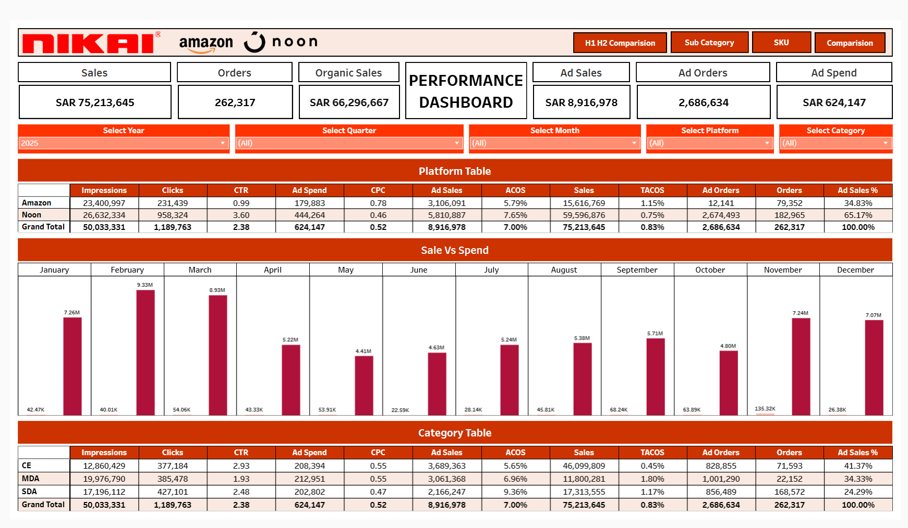

# 📊 Nikai KSA Performance Dashboard (Tableau)

## 🔗 Live Dashboard

👉 https://public.tableau.com/views/NikaiKSAPerformanceDashboard/MainDashbaord

---

## 📌 Project Overview

This project showcases a **comprehensive Tableau dashboard** designed to analyze the **e-commerce performance of the Nikai brand in KSA**.

The dashboard consolidates data from multiple sources to deliver **actionable business insights** across sales, advertising, and product performance.

It is built to support **data-driven decision-making** for marketing and business teams.

---

## 🎯 Business Objectives

* Monitor **overall business performance (Sales & Orders)**
* Evaluate **advertising effectiveness (Spend vs Revenue)**
* Identify **top-performing and underperforming SKUs**
* Track **category-level contribution to total revenue**
* Analyze **Month-over-Month (MoM) growth trends**

---

## 📊 Key Metrics (KPIs)

* 💰 Total Sales
* 📦 Total Orders
* 💸 Ad Spend
* 👁️ Impressions
* 🖱️ Clicks
* 🛒 Ad Orders
* 📈 Conversion Rate (CVR)
* 🎯 ROAS (Return on Ad Spend)

---

## 📈 Dashboard Features

* 📅 **Dynamic Month Selection** for flexible analysis
* 📦 **Category-wise Performance Breakdown**
* 🛒 **SKU-level Deep Dive Analysis**
* 📊 **Ad Type Analysis** (Sponsored Products, Brands, Display)
* 📉 **Month-over-Month Growth % Tracking**
* 🎯 **Interactive KPI Tiles for quick insights**

---

## 🧠 Key Insights Derived

* Top **20% SKUs contribute majority of revenue** (Pareto effect)
* **Sponsored Products** campaigns drive the highest conversions
* Certain categories show **high impressions but low conversion**, indicating optimization opportunities
* Identified **low ROAS campaigns** requiring budget reallocation

---

## 🛠️ Data Sources & Preparation

* Amazon Vendor & Seller Central data
* Advertising data (SP, SB, SD campaigns)
* Data cleaned and structured using **Excel**
* Metrics standardized for unified reporting

---

## 🧰 Tools & Technologies Used

* **Tableau Public** → Data Visualization
* **Microsoft Excel** → Data Cleaning & Transformation
* **Data Analysis Techniques** → KPI tracking, trend analysis, performance segmentation

---

## 📸 Dashboard Preview

---

## 🚀 How to Use the Dashboard

1. Select a **Month** using the filter
2. Analyze **KPI tiles** for overall performance
3. Explore **category & SKU-level breakdown**
4. Evaluate **ad performance metrics (ROAS, CTR, CVR)**
5. Identify **growth trends and optimization areas**

---

## 📌 Project Highlights

* Built an **end-to-end analytics solution** from raw data to insights
* Designed for **business stakeholders and marketing teams**
* Focused on **performance optimization and decision-making**
* Scalable structure for **multi-marketplace analysis (Amazon + Noon)**

---

## 👨‍💻 Author

**Pranav Vijay Dixit**
Business Analyst

🔗 Tableau Profile: https://public.tableau.com/app/profile/pranav2103
🔗 LinkedIn: https://www.linkedin.com/in/pranavdixitofficial/

---

